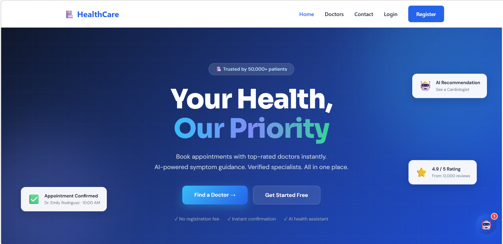
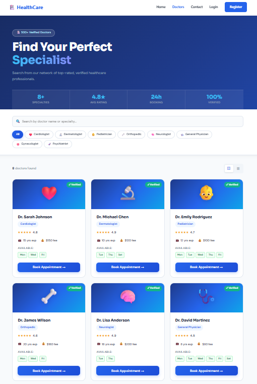
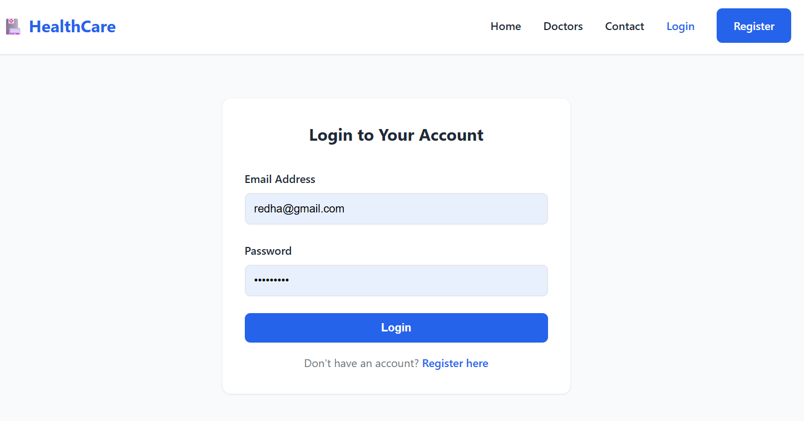
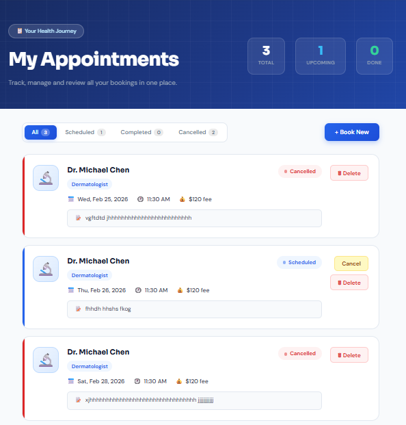
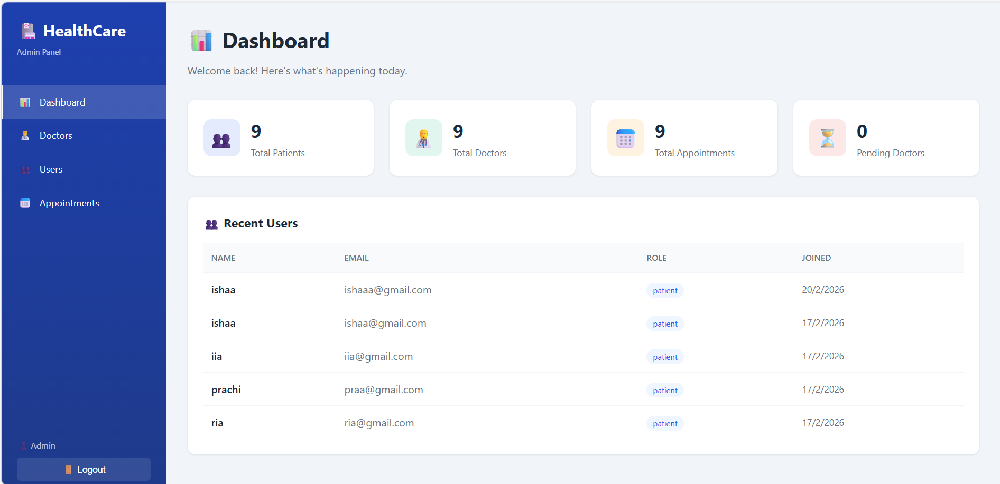
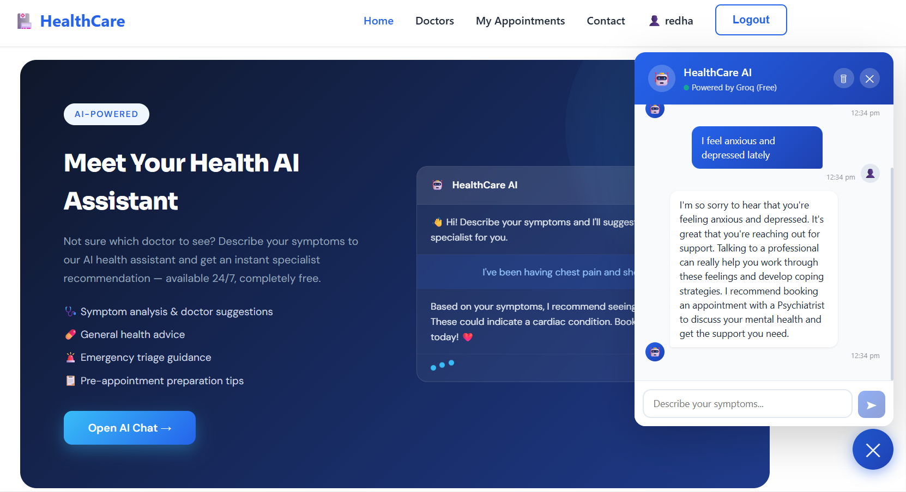

# 🏥 Doctor Appointment Management System

A full-stack healthcare appointment booking platform built with the MERN stack, featuring secure authentication, AI-powered symptom analysis, and comprehensive admin controls.

## 🌟 Features

### For Patients
- 🔐 **Secure Authentication** - Register and login with JWT token-based security
- 👨‍⚕️ **Browse Doctors** - Search and filter doctors by specialty
- 📅 **Book Appointments** - Select date, time, and reason for visit
- 📋 **My Appointments** - View, cancel, or delete your bookings
- 🤖 **AI Health Assistant** - Get instant symptom analysis and doctor recommendations

### For Admins
- 📊 **Dashboard** - Real-time statistics on users, doctors, and appointments
- 👥 **User Management** - View and manage all registered patients
- 🩺 **Doctor Management** - Add, edit, delete, and approve doctors
- 📅 **Appointment Control** - View and manage all system appointments
- 🛡️ **Role-Based Access** - Secure admin-only routes with middleware protection

### AI Integration
- 💬 **Intelligent Chatbot** - Powered by Groq's Llama 3.3 70B model
- ⚡ **Fast Responses** - 1-3 second response times
- 🔒 **Secure** - API keys protected via backend proxy pattern
- 🎯 **Accurate** - Recommends appropriate specialists based on symptoms

---

## 🛠️ Tech Stack

### Frontend
- **React 18** - UI library
- **Vite** - Build tool for fast development
- **Tailwind CSS** - Utility-first styling
- **React Router v6** - Client-side routing
- **Context API** - Global state management

### Backend
- **Node.js** - JavaScript runtime
- **Express.js** - Web framework
- **JWT** - Token-based authentication
- **bcrypt** - Password hashing (10 salt rounds)
- **Mongoose** - MongoDB object modeling

### Database
- **MongoDB** - NoSQL database
- **3 Collections** - users, doctors, appointments

### AI Integration
- **Groq API** - AI inference platform
- **Llama 3.3 70B** - Large language model

---

## 📁 Project Structure
```
doctor-appointment-app/
├── backend/
│   ├── controllers/
│   │   ├── authController.js
│   │   ├── appointmentController.js
│   │   ├── adminController.js
│   │   └── aiController.js
│   ├── middleware/
│   │   ├── authMiddleware.js
│   │   └── errorMiddleware.js
│   ├── models/
│   │   ├── User.js
│   │   ├── Doctor.js
│   │   └── Appointment.js
│   ├── routes/
│   │   ├── authRoutes.js
│   │   ├── appointmentRoutes.js
│   │   ├── adminRoutes.js
│   │   └── aiRoutes.js
│   ├── config/
│   │   └── db.js
│   ├── .env
│   ├── server.js
│   └── package.json
├── src/
│   ├── components/
│   │   ├── Navbar.jsx
│   │   ├── DoctorCard.jsx
│   │   └── AIChatBot.jsx
│   ├── pages/
│   │   ├── Home.jsx
│   │   ├── Doctors.jsx
│   │   ├── BookAppointment.jsx
│   │   ├── MyAppointments.jsx
│   │   ├── Login.jsx
│   │   ├── Register.jsx
│   │   └── admin/
│   ├── context/
│   │   └── AuthContext.jsx
│   ├── App.jsx
│   └── main.jsx
├── .gitignore
├── package.json
└── README.md
```

---

## 🚀 Getting Started

### Prerequisites
- **Node.js** (v14 or higher)
- **MongoDB** (local or MongoDB Atlas)
- **npm** or **yarn**

### Installation

1. **Clone the repository**
```bash
   git clone https://github.com/prachijha05/doctor-appointment-app.git
   cd doctor-appointment-app
```

2. **Install backend dependencies**
```bash
   cd backend
   npm install
```

3. **Install frontend dependencies**
```bash
   cd ..
   npm install
```

4. **Create environment variables**
   
   Create a `.env` file in the `backend` folder:
```env
   PORT=5000
   MONGO_URI=your_mongodb_connection_string
   JWT_SECRET=your_secret_key_here
   GROQ_API_KEY=your_groq_api_key
```

5. **Start MongoDB**
```bash
   # If using local MongoDB
   mongod
```

6. **Run the application**
   
   **Backend** (Terminal 1):
```bash
   cd backend
   npm start
```
   
   **Frontend** (Terminal 2):
```bash
   npm run dev
```

7. **Open your browser**
```
   http://localhost:5173
```

---

## 🔑 Admin Credentials

To access the admin panel:
```
Email: admin@healthcare.com
Password: admin123
```

Admin URL: `http://localhost:5173/admin/login`

---

## 📡 API Endpoints

### Authentication Routes
```
POST   /api/auth/register     - Register new user
POST   /api/auth/login        - User login
GET    /api/auth/me           - Get current user
PUT    /api/auth/update       - Update profile
```

### Appointment Routes (Protected)
```
POST   /api/appointments      - Create appointment
GET    /api/appointments      - Get user's appointments
PUT    /api/appointments/:id/cancel - Cancel appointment
DELETE /api/appointments/:id  - Delete appointment
```

### Admin Routes (Protected + Admin Role)
```
GET    /api/admin/dashboard   - Get statistics
GET    /api/admin/users       - Get all users
DELETE /api/admin/users/:id   - Delete user
GET    /api/admin/doctors     - Get all doctors
POST   /api/admin/doctors     - Add doctor
PUT    /api/admin/doctors/:id - Update doctor
DELETE /api/admin/doctors/:id - Delete doctor
GET    /api/admin/appointments - Get all appointments
DELETE /api/admin/appointments/:id - Delete appointment
```

### AI Routes (Protected)
```
POST   /api/ai/chat           - Chat with AI assistant
```

---

## 🔒 Security Features

- **JWT Authentication** - Stateless token-based auth with 7-day expiry
- **bcrypt Hashing** - Passwords hashed with 10 salt rounds
- **Middleware Protection** - `protect` middleware validates all secured routes
- **Role-Based Access** - `admin` middleware restricts admin routes
- **Backend Proxy** - AI API keys never exposed to frontend
- **CORS** - Cross-origin requests properly configured

---

## 🤖 AI Chatbot Flow
```
User Types Symptom
       ↓
React Frontend
       ↓
POST /api/ai/chat (with JWT)
       ↓
protect Middleware (validates token)
       ↓
Backend reads GROQ_API_KEY from .env
       ↓
Calls Groq API
       ↓
Llama 3.3 70B analyzes symptoms
       ↓
Returns doctor recommendation
       ↓
Response sent to React
       ↓
User sees recommendation
```

**Security:** API key stays on server, never exposed to client

---

## 📸 Screenshots

### Home Page


### Doctors Listing


### USER


### My Appointments


### Admin Dashboard


### AI Chatbot


---

## 🎯 Future Enhancements

- [ ] Payment gateway integration (Razorpay/Stripe)
- [ ] Email notifications for appointments
- [ ] Real-time chat between patients and doctors
- [ ] Prescription upload and management
- [ ] Video consultation feature
- [ ] Mobile app (React Native)
- [ ] SMS reminders for appointments
- [ ] Multi-language support
- [ ] Advanced analytics dashboard


## 🙏 Acknowledgments

- Groq for providing free AI inference
- MongoDB Atlas for database hosting
- All open-source contributors

---

## 📧 Contact

**Prachi Jha**
- GitHub: [prachijha](https://github.com/prachijha05)
- Email: prachijha@gmail.com
- LinkedIn: [LinkedIn](https://www.linkedin.com/in/prachi-jha-b084b828b/)

---

## ⭐ Show your support

Give a ⭐ if this project helped you!

---
